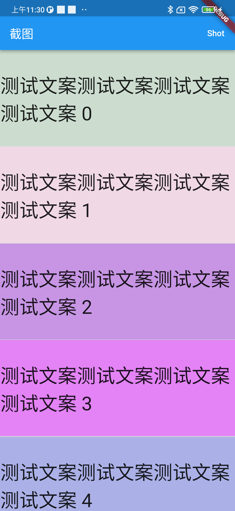
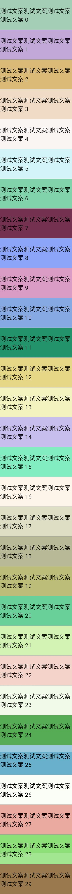

# widget_screenshot

Screenshot for widget，support long screenshot like ListView  

## Usage like `RepaintBoundary`

```dart
WidgetShot(
        key: _shotKey,
        child: ListView.separated(
            controller: _scrollController,
            itemBuilder: (context, index) {
              return Container(
                color: Color.fromARGB(
                    Random().nextInt(255), Random().nextInt(255), Random().nextInt(255), Random().nextInt(255)),
                height: 160,
                child: Center(
                  child: Text(
                    "测试文案测试文案测试文案测试文案 ${index}",
                    style: const TextStyle(fontSize: 32),
                  ),
                ),
              );
            },
            separatorBuilder: (context, index) {
              return const Divider(
                height: 1,
                color: Colors.grey,
              );
            },
            itemCount: 30),
      )
```

```dart
WidgetShotRenderRepaintBoundary repaintBoundary =
    _shotKey.currentContext!.findRenderObject() as WidgetShotRenderRepaintBoundary;
var resultImage = await repaintBoundary.screenshot(scrollController: _scrollController,pixelRatio: 1);
```

## Display

<div align="center">




</div>
